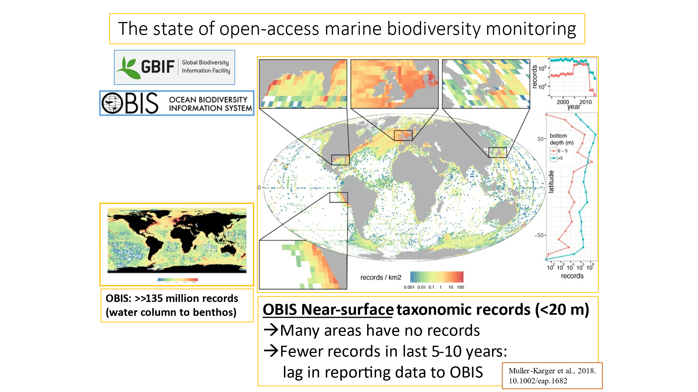

# obis-h3-map

Goal: Map OBIS data summarized by Uber H3 hexagons as a fast interactive map with filters.

### 2018 Map

Frank Muller-Karger: Is it possible to update this figure, and see how OBIS is growing? They have definitely added millions of records since 2018…

### 2025 Resources

That figure had a lot of manual tweaks to embed the zoomed in panels. I think the way forward here is to update the notebook:

* [bbest.github.io/obis-lat-time-fig](https://bbest.github.io/obis-lat-time-fig/)\
  (code: [github.com/bbest/obis-lat-time-fig/blob/gh-pages/index.Rmd](https://github.com/bbest/obis-lat-time-fig/blob/gh-pages/index.Rmd))

with the latest OBIS GeoParquet file available here:

* [obis.org/data/access](https://obis.org/data/access/)\
  **Download** button: [obis-datasets.s3.us-east-1.amazonaws.com/exports/obis\_20250318\_parquet.zip](https://obis-datasets.s3.us-east-1.amazonaws.com/exports/obis_20250318_parquet.zip)

And using this [**mapgl**](https://walker-data.com/mapgl/) R package with the following:

-   raster: cloud-optimized GeoTIFFs (**COGs**; tiled with [developmentseed.org/titiler](https://developmentseed.org/titiler/))
    -   [add\_raster\_source()](https://walker-data.com/mapgl/reference/add_raster_source.html)
    -   [add\_raster\_layer()](https://walker-data.com/mapgl/reference/add_raster_layer.html)
    -   [How to Implement Tiles? · walkerke/mapgl](https://github.com/walkerke/mapgl/issues/23#issuecomment-2243739349)[#23](https://github.com/walkerke/mapgl/issues/23#issuecomment-2243739349)
-   vector: **H3 hexagons** (per Uber's [h3geo.org](https://h3geo.org/))
    -   [add\_h3j\_source()](https://walker-data.com/mapgl/reference/add_h3j_source.html) and change source based on zoom level to coarser/finer H3
    -   [add\_fill\_layer()](https://walker-data.com/mapgl/reference/add_fill_layer.html) or [add\_fill\_extrusion\_layer()](https://walker-data.com/mapgl/reference/add_fill_extrusion_layer.html)
    -   [support H3 spatial indexed data via the h3j extension? · Issue #68 · walkerke/mapgl](https://github.com/walkerke/mapgl/issues/68)
        -   [GBIF Observations Explorer](https://streamlit.carlboettiger.info/)  
        GBIF is a biodiversity occurrence dataset of some 3 billion rows, about half a terrabyte as parquet point data. Here is a demo app that bins the data by H3 hexes at various resolutions. You can aggregate data for the country or the world using low zooms (h4 or say) quite quickly, or zoom into a state or national park and aggregate at much finer resolutions:  
        \-- Carl Boettiger
-   **StoryMap**: zoom to areas on scroll
    -   [Building story maps with mapgl • mapgl](https://walker-data.com/mapgl/articles/story-maps.html)

